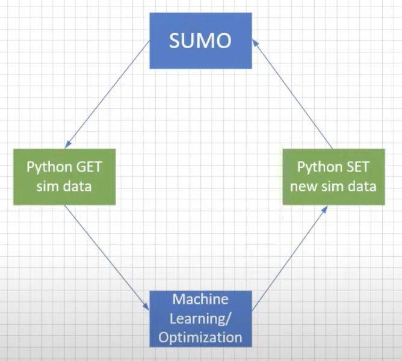
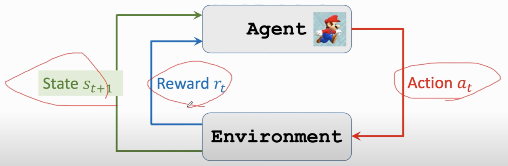

# dissertation

## run sumo
1. export SUMO_HOME="$PWD/sumo"
2. cd $SUMO_HOME 
3. cd bin
4. ./sumo-gui
5. cd sumo/tools
6. python osmWebWizard.py
7. select Area and Generate Scenario

## python create net and route

## Macbook Tutorial:
install stallation guide: https://www.youtube.com/watch?v=JAAPLxgQ5UQ

net.xml: is the file "osm.net.xml.gz"

route.xml: is the file "osm.passenger.trips.xml"

## python run SUMO
guide: https://www.youtube.com/watch?v=zQH1n0Fvxes&t=407s

## problems
current problem: the software sometime crashes

## change bash and zsh
hsh -s /bin/bash

chsh -s /bin/zsh

## Reinforcement Learning
link: 

https://www.youtube.com/watch?v=FgzM3zpZ55o&list=PLoROMvodv4rOSOPzutgyCTapiGlY2Nd8u

https://www.youtube.com/watch?v=vmkRMvhCW5c&list=PLvOO0btloRnsiqM72G4Uid0UWljikENlU&index=1

https://www.javatpoint.com/reinforcement-learning

https://towardsdatascience.com/reinforcement-learning-101-e24b50e1d292

### basic concept
station  this frame

action   going to do 

agent    action of a subject

policy   policy function P(A=a|S=s) upon observing state S=s, the agent's action A can be random

reward R 

state transition   old station > action > new station 

Randomness in Reinforcement Learning 

1. action have randomness
2. state transitions have randomness

return (cumulative future reward)

r: discount rate (tuning hyper-parameter)

Ut = Rt + rRt+1 + r**2Rt+2 + r**3Rt+3 + ...

action-value function for policy 

Q(s, a) = E(Ut(S=s, A=a))

optimal action-value function

Q* = maxQ(s, a)

state-value function 

V = E(Q(s, A))

### Value-Based Reinforecement Learning
Deep Q-network(DQN)

goal maximinze the taoal reword 

a* = argmax Q*(s, a)

challenge: use neural network Q(s, a; w) to approximate Q*(s, a)

TD(Temporal Different) Learning

Ut = Rt + rUt+1

### Policy-based Reinforcement Learning 
policy function P(A=a|S=s)

state-value function

V(s; θ) = sum(π(a|s; θ)*Q(s, a))

policy-based learning: J(θ) = E(V(S; θ))

### Actor-Critic Methods
combine value-based and policy-based

### AlphaGo 
training and Execution
1. initialize policy network using behavior cloning
2. Train the policy network using policy gradient
3. After training the policy network, use it to train a value network

Execution (actually play Go games):

Do Monte Carlo Tree Search(MCTS) using the policy and value networks

### Monte Carlo Tree Search(MCTS)
1. selection: imaginary action, every action has a score 
2. expansion: imaginary action, the opponent makes an action, 
3. evaluation: evaluate the state-value and get score v, receive reword
4. backup: update action-value
